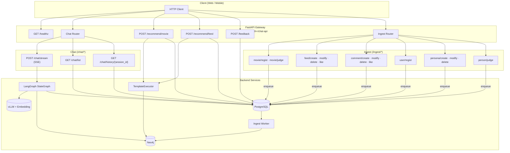
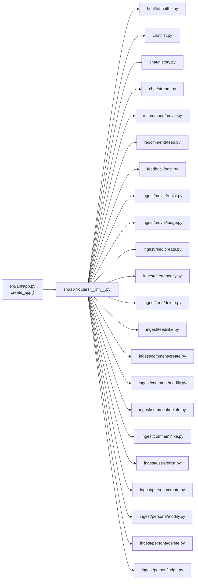
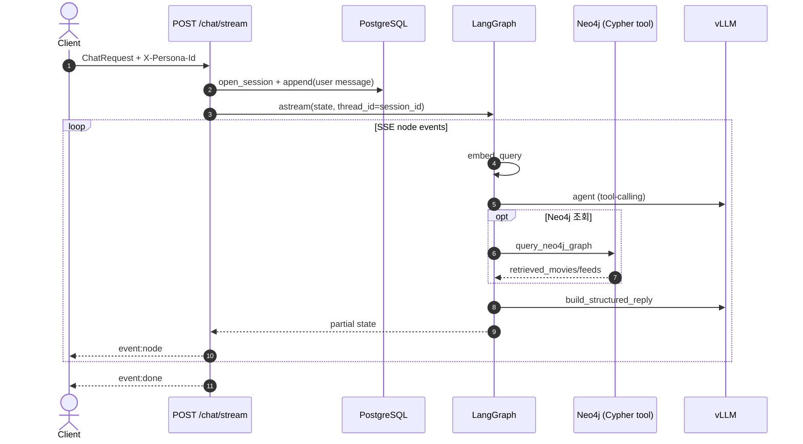
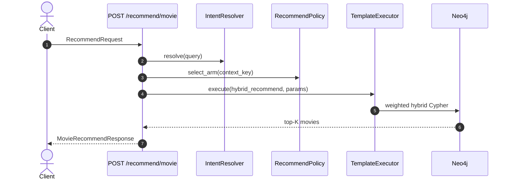
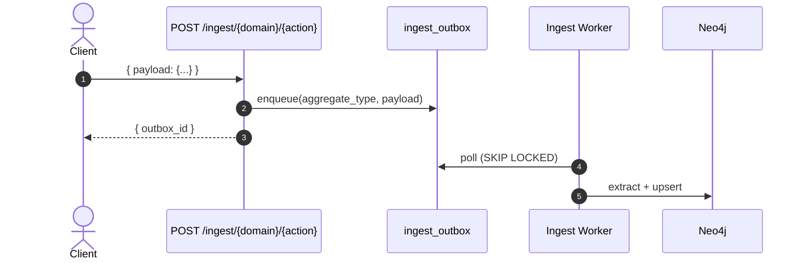

# HTTP API

FastAPI 게이트웨이 ([`src/api/app.py`](../src/api/app.py)) 는 **Chat · Recommend · Ingest · Feedback · Health** 5개 도메인으로 구성된다.
라우터 집합은 [`src/api/routers/__init__.py`](../src/api/routers/__init__.py) 에서 등록한다.

> **Persona**: 추천·세션·피드백의 최소 단위. `(user_id, persona_id)` 로 스코프된다.
> 상세: [persona_recommendation.md](persona_recommendation.md)

---

## 1. API 구조도

### 1-1. High-Level



### 1-2. 라우터 모듈 구조



| 디렉터리 | 책임 |
|----------|------|
| `src/api/app.py` | FastAPI 인스턴스 조립, CORS, `root_path`, shutdown 시 outbox flush |
| `src/api/dependencies.py` | `AppContainer` 싱글턴 (Neo4j, LangGraph, Bandit, TemplateExecutor 등) |
| `src/api/routers/` | HTTP 핸들러 — 입출력 변환 + 도메인 호출만 |
| `src/api/schemas/` | Pydantic 요청/응답 스키마 |

---

## 2. 실행 · Base URL

```bash
uvicorn src.api.app:app --host 0.0.0.0 --port 8080 --reload
```

| 항목 | 값 |
|------|-----|
| OpenAPI | `/docs`, `/redoc`, `/openapi.json` |
| `root_path` | `/chat-api` — 리버스 프록시 뒤에서 prefix 로 사용 |
| 로컬 직접 호출 | `http://localhost:8080/...` |
| 프록시 경유 | `https://{host}/chat-api/...` |

스키마 초기화: `python -m scripts.bootstrap_schema`

---

## 3. Persona 전달 규약

| 방식 | 적용 엔드포인트 |
|------|----------------|
| `X-Persona-Id` 헤더 | `/chat/stream`, `/chat/list`, `/chat/history/{session_id}`, `/recommend/movie`, `/recommend/feed` |
| body `persona_id` | `ChatRequest`, `RecommendRequest`, `FeedbackRequest`, feed/comment/person ingest payload |

`persona_id` 가 존재하면 Persona 스코프로 추천·Bandit·세션이 동작한다. 없으면 `user_id` 단독 fallback.

Bandit `context_key` = `{user_id}:{persona_id}` (persona 없으면 `user_id`).

---

## 4. 엔드포인트 목록

### 4-1. Health

| Method | Path | 응답 | 설명 |
|--------|------|------|------|
| GET | `/healthz` | `{"status":"ok"}` | Liveness probe |

### 4-2. Chat

| Method | Path | 요청 | 응답 | 설명 |
|--------|------|------|------|------|
| POST | `/chat/stream` | `ChatRequest` + `X-Persona-Id` | SSE | LangGraph 노드 단위 스트리밍 |
| GET | `/chat/list` | Query: `user_id`, `cursor?`, `limit?` + `X-Persona-Id` | `list[ChatSession]` | Persona별 세션 목록 |
| GET | `/chat/history/{session_id}` | Query: `user_id`, `cursor?`, `limit?` + `X-Persona-Id` | `ChatSessionResponse` | 세션 메시지 이력 (cursor 페이지네이션) |

> 단발 `/chat` (non-stream) 엔드포인트는 없다. 클라이언트는 `/chat/stream` 을 사용한다.

**`ChatRequest`**

| 필드 | 타입 | 필수 | 기본값 | 설명 |
|------|------|------|--------|------|
| `user_id` | string | Y | — | 계정 ID |
| `persona_id` | string | N | null | Persona ID (헤더와 병행 가능) |
| `session_id` | string | N | UUID 자동 생성 | 대화 세션 |
| `message` | string | Y | — | 사용자 메시지 |
| `top_k` | int | N | 10 | 추천 후보 수 (1–50) |
| `max_toxicity` | float | N | 0.7 | toxicity 필터 상한 |

**SSE 이벤트 (`/chat/stream`)**

| event | data | 설명 |
|-------|------|------|
| `open` | `{session_id, message_id}` | 스트림 시작 |
| `node` | LangGraph partial state JSON | 노드별 중간 상태 |
| `error` | `{detail}` | 예외 발생 |
| `done` | `{session_id}` | 스트림 종료 |

### 4-3. Recommend

| Method | Path | 요청 | 응답 | 설명 |
|--------|------|------|------|------|
| POST | `/recommend/movie` | `RecommendRequest` + `X-Persona-Id` | `MovieRecommendResponse` | LangGraph 우회 단발 hybrid 영화 추천 |
| POST | `/recommend/feed` | `RecommendRequest` + `X-Persona-Id` | `FeedRecommendResponse` | LangGraph 우회 단발 hybrid 피드 추천 |

**`RecommendRequest`**

| 필드 | 타입 | 필수 | 기본값 |
|------|------|------|--------|
| `user_id` | string | Y | — |
| `persona_id` | string | N | null |
| `query` | string | Y | — |
| `top_k` | int | N | 10 |
| `vec_top_k` | int | N | 30 |
| `max_toxicity` | float | N | 0.7 |

**`MovieRecommendResponse`**: `{ arm_id, movies[{movie_id, title, plot_summary, score}], keywords[], themes[], moods[] }`

**`FeedRecommendResponse`**: `{ arm_id, feeds[{feed_id, summary, sentiment_score, score}], keywords[], themes[], moods[] }`

처리 흐름: `IntentResolver.resolve(query)` → `embedder.embed(query)` → `RecommendPolicy.select_arm(context_key)` → `TemplateExecutor.execute("hybrid_recommend" | "hybrid_feed_recommend")`

### 4-4. Feedback

| Method | Path | 요청 | 응답 | 설명 |
|--------|------|------|------|------|
| POST | `/feedback` | `FeedbackRequest` | `FeedbackResponse` | Bandit posterior 갱신 |

**`FeedbackRequest`**

| 필드 | 타입 | 필수 | 설명 |
|------|------|------|------|
| `user_id` | string | Y | 계정 ID |
| `persona_id` | string | N | Persona ID |
| `arm_id` | string | Y | 노출된 Bandit arm |
| `action` | enum | Y | `click` \| `dwell` \| `like` \| `skip` \| `dislike` |
| `content_type` | enum | Y | `feed` \| `comment` \| `movie` |
| `dwell_seconds` | float | N | 체류 시간 (기본 0) |

**`FeedbackResponse`**: `{ arm_id, reward }` — reward 양수 → α 증가, 음수 → β 증가.

### 4-5. Ingest (Outbox Enqueue)

모든 ingest 엔드포인트는 **Envelope 패턴** `{ "payload": { ... } }` 를 사용한다.
API는 `ingest_outbox` 에 적재만 하고, 실제 Neo4j 적재는 [Outbox Worker](outbox_ingest.md) 가 수행한다.

**공통 응답 `IngestResponse`**: `{ "outbox_id": int }`

#### Movie

| Method | Path | Envelope | aggregate_type |
|--------|------|----------|----------------|
| POST | `/ingest/movie/regist` | `IngestMovieEnvelope` | `movie` |
| POST | `/ingest/movie/judge` | `IngestMovieJudgeEnvelope` | `movie_judge` |

**`IngestMoviePayload`**: `movie_id`, `title`, `producing_year?`, `country?`, `genres[]`, `plot?`, `persons[]`

**`IngestMovieJudgePayload`**: `movie_id`, `user_id`, `persona_id?`, `judge_type` (`like`|`dislike`), `created_at?`

#### Feed

| Method | Path | Envelope | aggregate_type |
|--------|------|----------|----------------|
| POST | `/ingest/feed/create` | `IngestFeedEnvelope` | `feed` |
| POST | `/ingest/feed/modify` | `IngestFeedEnvelope` | `feed_modify` |
| POST | `/ingest/feed/delete` | `IngestFeedDeleteEnvelope` | `feed_delete` |
| POST | `/ingest/feed/like` | `IngestFeedLikeEnvelope` | `feed_like` |

**`IngestFeedPayload`**: `feed_id`, `user_id`, `persona_id?`, `related_movie_id?`, `known_movie_ids[]`, `mentioned_user_ids[]`, `content`, `created_at?`, `modified_at?`

**`IngestFeedLikePayload`**: `feed_id`, `user_id`, `persona_id?`, `is_like`, `created_at?`

**`IngestFeedDeletePayload`**: `feed_id`, `user_id`, `deleted_at?`

#### Comment

| Method | Path | Envelope | aggregate_type |
|--------|------|----------|----------------|
| POST | `/ingest/comment/create` | `IngestCommentEnvelope` | `comment` |
| POST | `/ingest/comment/modify` | `IngestCommentEnvelope` | `comment_modify` |
| POST | `/ingest/comment/delete` | `IngestCommentDeleteEnvelope` | `comment_delete` |
| POST | `/ingest/comment/like` | `IngestCommentLikeEnvelope` | `comment_like` |

**`IngestCommentPayload`**: `comment_id`, `feed_id`, `user_id`, `persona_id?`, `mentioned_user_ids[]`, `parent_comment_id?`, `content`, `created_at?`, `modified_at?`

**`IngestCommentLikePayload`**: `comment_id`, `user_id`, `persona_id?`, `is_like`, `created_at?`

**`IngestCommentDeletePayload`**: `comment_id`, `user_id`, `deleted_at?`

#### User / Persona

| Method | Path | Envelope | aggregate_type |
|--------|------|----------|----------------|
| POST | `/ingest/user/regist` | `IngestUserEnvelope` | `user` |
| POST | `/ingest/persona/create` | `IngestPersonaEnvelope` | `persona` |
| POST | `/ingest/persona/modify` | `IngestPersonaEnvelope` | `persona_modify` |
| POST | `/ingest/persona/delete` | `IngestPersonaDeleteEnvelope` | `persona_delete` |
| POST | `/ingest/person/judge` | `IngestPersonJudgeEnvelope` | `person_judge` |

**`IngestUserPayload`**: `user_id`, `nickname?`, `created_at?`

**`IngestPersonaPayload`**: `persona_id`, `user_id`, `label?`, `genres[]`, `movies[]`, `persons[]`, `created_at?`, `modified_at?`

**`IngestPersonaDeletePayload`**: `persona_id`, `user_id`

**`IngestPersonJudgePayload`**: `person_id`, `user_id`, `persona_id?`, `judge_type`, `created_at?`

---

## 5. 요청 흐름

### 5-1. Chat Stream



### 5-2. Recommend (Movie)



### 5-3. Ingest Enqueue



---

## 6. curl 예시

### Chat Stream

```bash
curl -N http://localhost:8080/chat/stream \
  -H 'content-type: application/json' \
  -H 'X-Persona-Id: movie_buff' \
  -d '{
        "user_id": "u-1",
        "message": "잔잔한 한국 가족 영화 추천해줘"
      }'
```

### 세션 목록

```bash
curl -s 'http://localhost:8080/chat/list?user_id=u-1&limit=20' \
  -H 'X-Persona-Id: movie_buff' | jq
```

### 세션 이력

```bash
curl -s 'http://localhost:8080/chat/history/{session_id}?user_id=u-1&limit=20' \
  -H 'X-Persona-Id: movie_buff' | jq
```

### Recommend Movie

```bash
curl -s http://localhost:8080/recommend/movie \
  -H 'content-type: application/json' \
  -H 'X-Persona-Id: family_night' \
  -d '{
        "user_id": "u-1",
        "query": "아이와 볼 만한 애니메이션"
      }' | jq
```

### Recommend Feed

```bash
curl -s http://localhost:8080/recommend/feed \
  -H 'content-type: application/json' \
  -H 'X-Persona-Id: movie_buff' \
  -d '{
        "user_id": "u-1",
        "query": "기생충 감상 후기"
      }' | jq
```

### Feed Create (Envelope)

```bash
curl -s http://localhost:8080/ingest/feed/create \
  -H 'content-type: application/json' \
  -d '{
        "payload": {
          "feed_id": "f-001",
          "user_id": "u-1",
          "persona_id": "movie_buff",
          "content": "기생충 다시 봤는데 레이어가 더 보임"
        }
      }' | jq
```

### Persona Create

```bash
curl -s http://localhost:8080/ingest/persona/create \
  -H 'content-type: application/json' \
  -d '{
        "payload": {
          "persona_id": "movie_buff",
          "user_id": "u-1",
          "label": "영화 덕후",
          "genres": ["drama", "thriller"]
        }
      }' | jq
```

### Movie Regist

```bash
curl -s http://localhost:8080/ingest/movie/regist \
  -H 'content-type: application/json' \
  -d '{
        "payload": {
          "movie_id": "m-001",
          "title": "기생충",
          "producing_year": 2019,
          "country": "KR",
          "genres": ["드라마", "스릴러"],
          "plot": "전원백수 가족이..."
        }
      }' | jq
```

### Feedback

```bash
curl -s http://localhost:8080/feedback \
  -H 'content-type: application/json' \
  -d '{
        "user_id": "u-1",
        "persona_id": "movie_buff",
        "arm_id": "balanced",
        "action": "like",
        "content_type": "movie"
      }' | jq
```

---

## 7. 스키마 참조

| 도메인 | 스키마 파일 |
|--------|------------|
| Chat | [`src/api/schemas/chat.py`](../src/api/schemas/chat.py) |
| Recommend | [`src/api/schemas/recommend.py`](../src/api/schemas/recommend.py) |
| Feedback | [`src/api/schemas/feedback.py`](../src/api/schemas/feedback.py) |
| Ingest Envelope | [`src/api/schemas/ingest.py`](../src/api/schemas/ingest.py) |
| Movie | [`src/api/schemas/movie.py`](../src/api/schemas/movie.py) |
| Feed | [`src/api/schemas/feed.py`](../src/api/schemas/feed.py) |
| Comment | [`src/api/schemas/comment.py`](../src/api/schemas/comment.py) |
| User | [`src/api/schemas/user.py`](../src/api/schemas/user.py) |
| Persona | [`src/api/schemas/persona.py`](../src/api/schemas/persona.py) |
| Person | [`src/api/schemas/person.py`](../src/api/schemas/person.py) |
