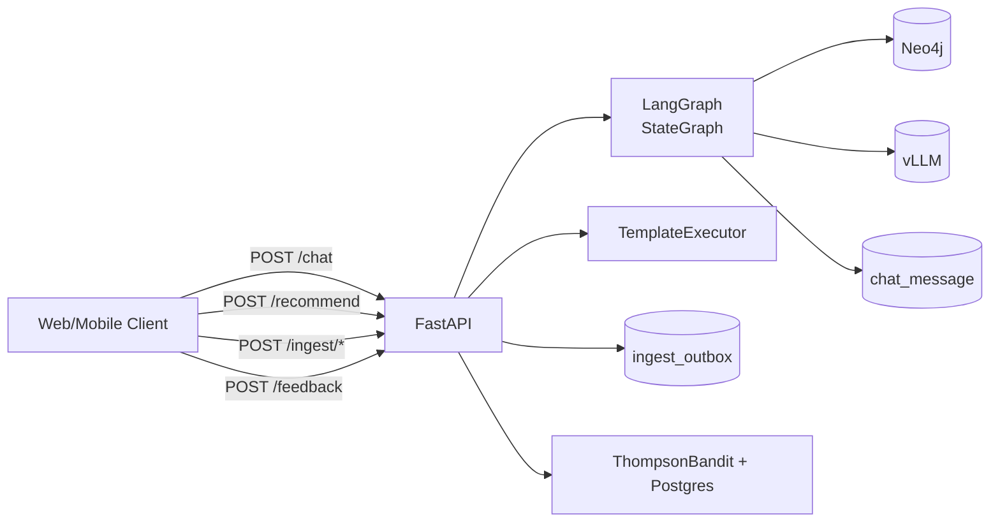

# HTTP API

FastAPI 라우터 ([src/api/routers.py](../src/api/routers.py)) 는 5개의 엔드포인트와 헬스체크로 구성된다.



## 실행

```bash
uvicorn src.api.app:app --host 0.0.0.0 --port 8080 --reload
```

`bootstrap_schema.py` 가 Postgres / Neo4j / LangGraph checkpoint 테이블을 모두 초기화한다.

## 엔드포인트

| Method | Path | 설명 |
|--------|------|------|
| GET    | `/healthz` | liveness probe |
| POST   | `/chat` | LangGraph 단발 invoke. `session_id` 미지정 시 자동 생성, 세션 메모리는 PostgresSaver 로 유지된다. |
| POST   | `/chat/stream` | SSE 스트리밍 — 노드 단위 부분 상태를 전송 (디버깅용) |
| POST   | `/recommend` | LangGraph 우회 단발 추천. `IntentResolver` + `TemplateExecutor` 만 사용. |
| POST   | `/ingest/movie` \| `/ingest/feed` \| `/ingest/comment` | `OutboxWriter.enqueue` 만 호출 (실 적재는 worker) |
| POST   | `/feedback` | `arm_id + action(+dwell_seconds)` → `RecommendPolicy.record_reward` → DB write-through |

요청/응답 스키마는 [src/api/schemas.py](../src/api/schemas.py) 참고.

### 예시: `/chat`

```bash
curl -s http://localhost:8080/chat \
  -H 'content-type: application/json' \
  -d '{
        "user_id": "u-1",
        "message": "잔잔한 한국 가족 영화 추천해줘"
      }' | jq
```

```json
{
  "session_id": "…",
  "reply": "이런 영화를 추천드려요: 기생충, …",
  "arm_id": "balanced",
  "movies": [{"movie_id": "m-001", "title": "기생충", "score": 0.78}],
  "ontology_ref": {"arm_id": "balanced", "movie_ids": ["m-001"], "themes": ["가족"]}
}
```

### 예시: `/feedback`

```bash
curl -s http://localhost:8080/feedback \
  -H 'content-type: application/json' \
  -d '{"user_id": "u-1", "arm_id": "balanced", "action": "like"}'
```

응답 `reward` 가 양수면 해당 arm 의 α 가, 음수면 β 가 증가한다 (Beta posterior).
