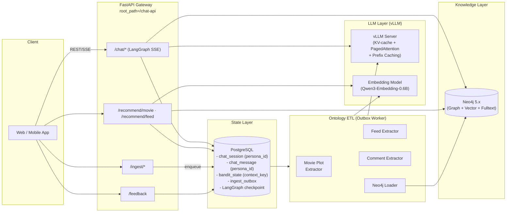
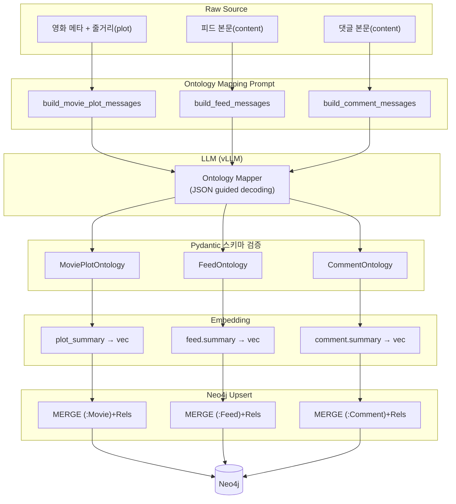
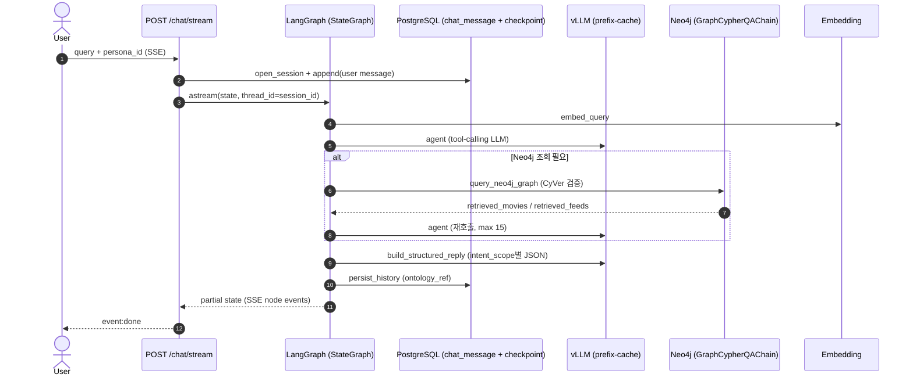
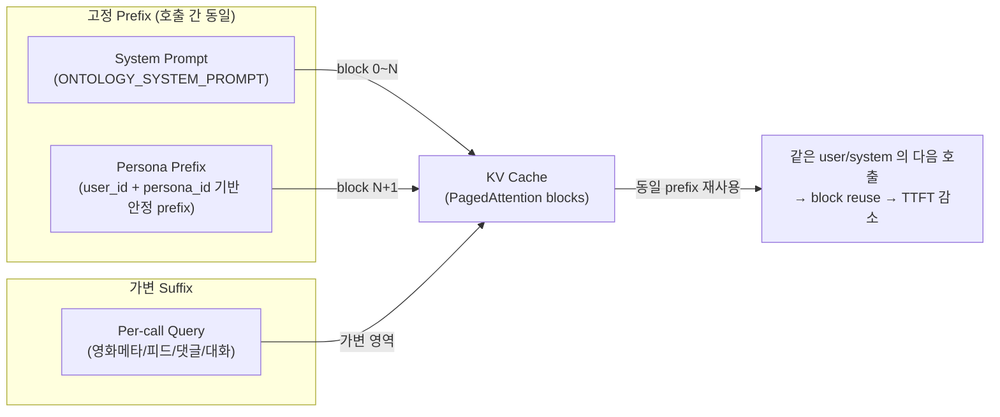
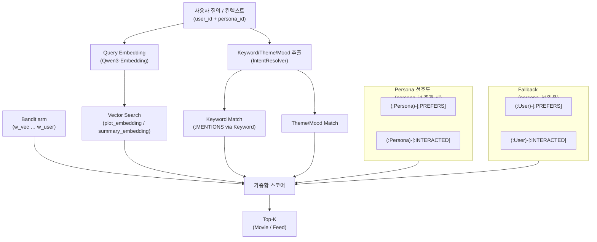

# 시스템 아키텍처

> Knowledge-graph 기반 영화/피드 추천 + LLM Chat 서비스의 전체 아키텍처.
> 모든 다이어그램은 Mermaid 로 작성한다.

---

## 1. High-Level Component View



---

## 2. 온톨로지 ETL 파이프라인 (비정형 → 지식그래프)



Ingest API 는 `ingest_outbox` 에만 적재하고, 실제 ETL 은 [Outbox Worker](outbox_ingest.md) 가 비동기 수행한다.

---

## 3. 사용자 Chat 흐름 (LangGraph)

`src/chat/graph.py` 의 StateGraph 노드 시퀀스:

```
START → embed_query → agent
                         ├─ (tool_calls) → neo4j_tools → agent  (루프, max 15)
                         └─ (no tools)   → persist_history → END
```



- **agent** : `query_neo4j_graph` tool 이 필요할 때만 Neo4j 조회. 단순 인사는 tool 없이 종료.
- **neo4j_tools** : `Neo4jCypherService` (`GraphCypherQAChain` + CyVer) — read-only Cypher 생성·실행.
- **persist_history** : `build_structured_reply` 결과를 `chat_message` 에 저장.

체크포인트는 `langgraph-checkpoint-postgres` 의 `PostgresSaver` 가 담당하며,
세션별 thread_id = `session_id` 규약을 따른다.

> Chat 은 Bandit arm 을 직접 선택하지 않는다. 하이브리드 가중치 학습은 `/recommend/*` + `/feedback` 경로에서 수행한다.

---

## 4. vLLM KV-Cache 재사용 전략



> **운영 가이드**
> - vLLM 실행 시 `--enable-prefix-caching --enable-chunked-prefill` 옵션 필수.
> - 시스템 프롬프트(`ONTOLOGY_SYSTEM_PROMPT`) 는 **불변 상수**로 유지.
> - 사용자별 가변 정보(피드/영화 메타)는 user role 메시지의 **뒤쪽**에 배치.
> - `user_id` 를 OpenAI 호환 `user` 필드로 전달해 서버 사이드 로깅/라우팅을 잡는다.

---

## 5. 추천 알고리즘 (Hybrid: Semantic × Keyword × Graph × Persona)

> Persona 는 추천의 **최소 단위**이다. `(user_id, persona_id)` 로 선호·Bandit·세션이 스코프된다.
> 상세: [persona_recommendation.md](persona_recommendation.md)



### 5-1. Cypher 실행 경로

| 경로 | Cypher 생성 | 템플릿 |
|------|-------------|--------|
| `/recommend/movie` | `TemplateExecutor` | `hybrid_recommend` |
| `/recommend/feed` | `TemplateExecutor` | `hybrid_feed_recommend` |
| Chat (`/chat/stream`) | `GraphCypherQAChain` | read-only, CyVer 검증 |

### 5-2. 도메인별 Persona 파생

| 도메인 | 엔드포인트 | Persona 역할 |
|--------|-----------|--------------|
| Chat | `/chat/stream` | 세션 이력·체크포인트 스코프. Neo4j 조회는 Agent tool |
| Movie | `/recommend/movie` | Bandit arm + hybrid Cypher `$persona_id` |
| Feed | `/recommend/feed` | Bandit arm + hybrid feed Cypher `$persona_id` |
| Ingest | `/ingest/feed`, `/ingest/comment` | `WRITTEN_BY` Persona, Persona-scoped `INTERACTED` |
| Feedback | `/feedback` | `context_key = user_id:persona_id` posterior 갱신 |
