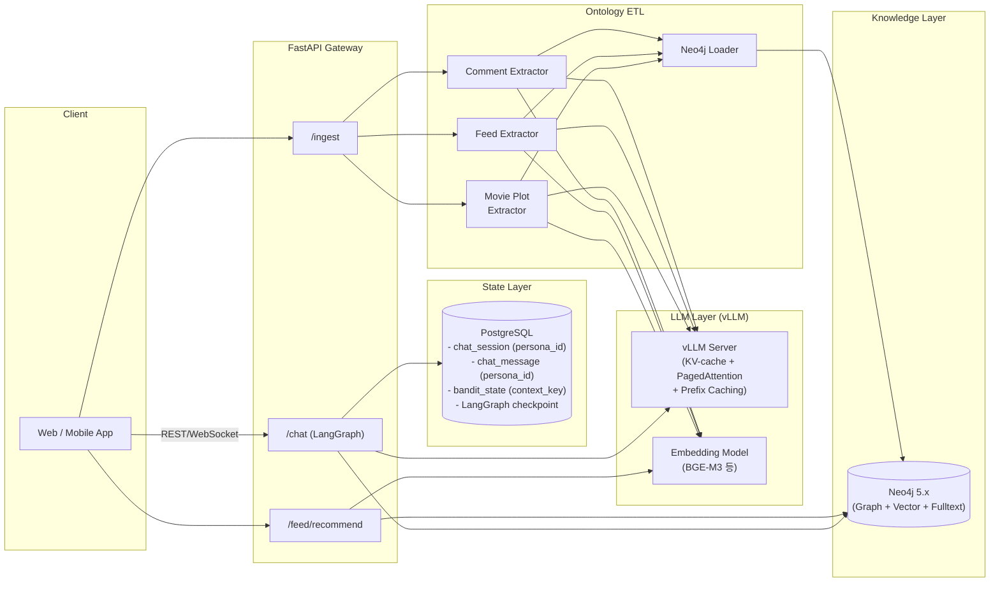
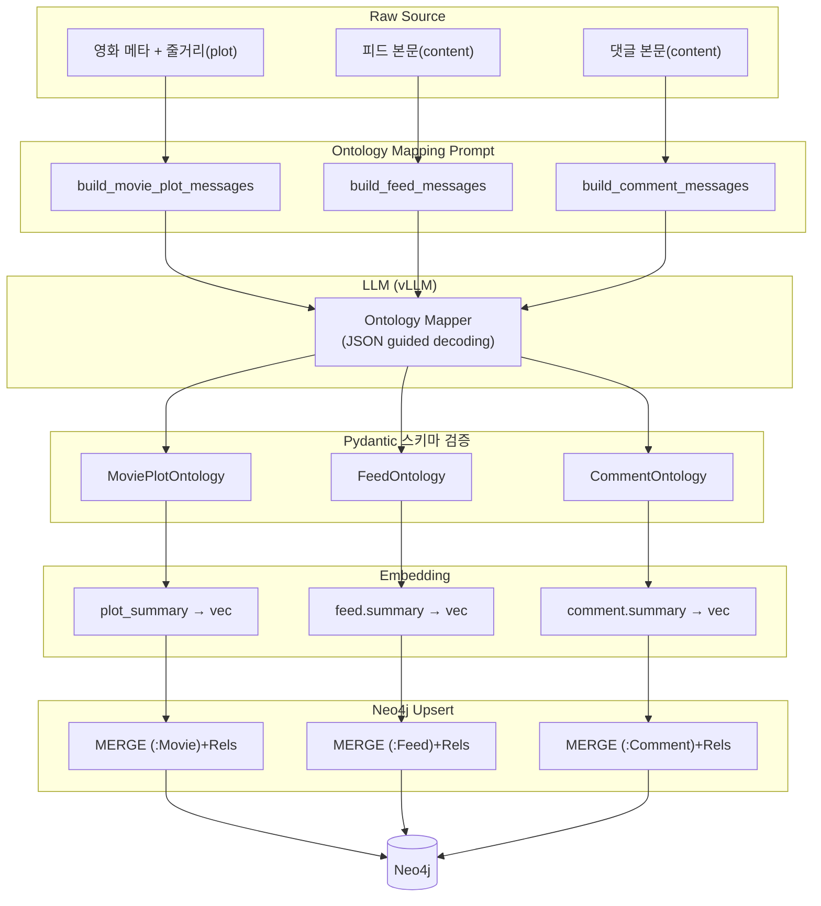
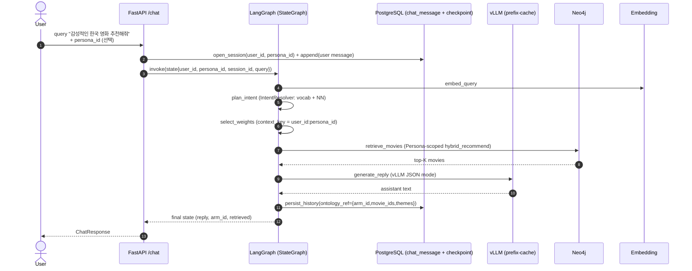
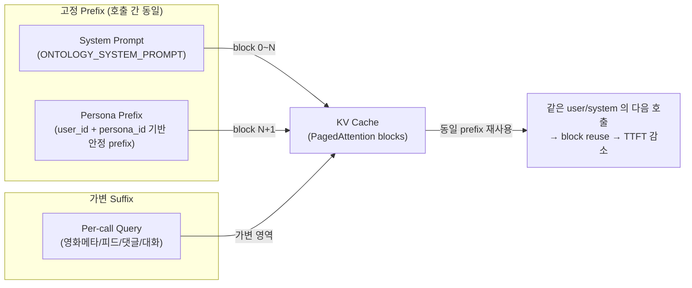
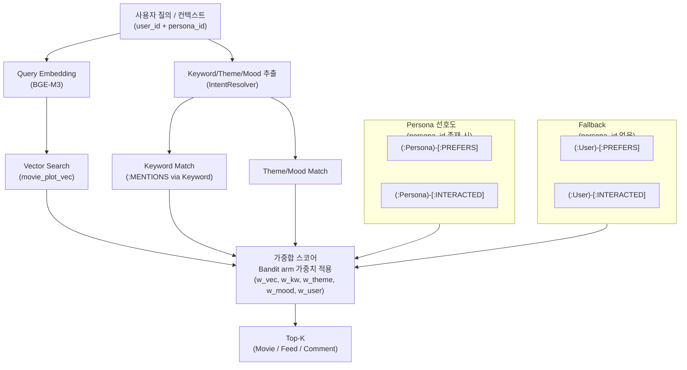

# 시스템 아키텍처

> Knowledge-graph 기반 영화/피드 추천 + LLM Chat 서비스의 전체 아키텍처.
> 모든 다이어그램은 Mermaid 로 작성한다.

---

## 1. High-Level Component View

---

## 2. 온톨로지 ETL 파이프라인 (비정형 → 지식그래프)

---

## 3. 사용자 Chat 흐름 (LangGraph)

`src/chat/graph.py` 의 StateGraph 노드 시퀀스는 다음과 같다.

체크포인트는 `langgraph-checkpoint-postgres` 의 `PostgresSaver` 가 담당하며,
세션별 thread_id = `session_id` 규약을 따른다.

---

## 4. vLLM KV-Cache 재사용 전략

> **운영 가이드**
> - vLLM 실행 시 `--enable-prefix-caching --enable-chunked-prefill` 옵션 필수.
> - 시스템 프롬프트(`ONTOLOGY_SYSTEM_PROMPT`) 는 **불변 상수**로 유지.
> - 사용자별 가변 정보(피드/영화 메타)는 user role 메시지의 **뒤쪽**에 배치.
> - `user_id` 를 OpenAI 호환 `user` 필드로 전달해 서버 사이드 로깅/라우팅을 잡는다.

---

## 5. 추천 알고리즘 (Hybrid: Semantic × Keyword × Graph × Persona)

> Persona 는 추천의 **최소 단위**이다. `(user_id, persona_id)` 로 선호·Bandit·세션이 스코프된다.
> 상세: [persona_recommendation.md](persona_recommendation.md)

### 5-1. 도메인별 Persona 파생

| 도메인 | 엔드포인트 | Persona 역할 |
|--------|-----------|--------------|
| Chat | `/chat` | LangGraph `select_weights` + `retrieve_movies` + 세션 이력 |
| Movie | `/recommend` | Bandit arm + hybrid Cypher `$persona_id` |
| Feed | `/ingest/feed` + 랭킹 | `WRITTEN_BY` Persona, Persona-scoped `INTERACTED` |
| Comment | `/ingest/comment` + 랭킹 | Persona affinity + intent/sentiment 부스트 |
| Feedback | `/feedback` | `context_key = user_id:persona_id` posterior 갱신 |
