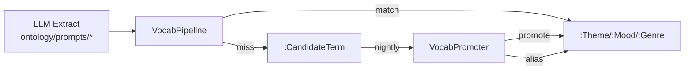

# Auto-evolving Vocabulary

LLM 이 추출한 themes/moods/keywords 를 Neo4j 표준 어휘(`Genre`/`Theme`/`Mood`) 와 점진적으로 정렬한다.



---

## Components

| Module | Role |
|--------|------|
| `src/vocab/normalizer.py` | `VocabularyNormalizer` — library md 기반 표준어 매칭 |
| `src/vocab/candidate_store.py` | `CandidateStore.observe()` — 미매칭 term 빈도 집계 |
| `src/vocab/pipeline.py` | `VocabPipeline` — extract 결과 정규화 + candidate 관측 |
| `src/vocab/promoter.py` | `VocabPromoter.run_batch()` — 승격/alias 배치 |
| `src/vocab/aliaser.py` | `cosine_similarity()` — embedding 기반 alias 후보 |
| `src/ontology/prompts/schema_vocab.py` | movie 프롬프트에 폐쇄형 vocab 주입 |

---

## 시드 데이터

```bash
python scripts/seed_vocab_from_library.py
```

소스: [genre_theme_mood_library.md](genre_theme_mood_library.md) → Neo4j `Genre`/`Theme`/`Mood` 노드

---

## Configuration

| Variable | Default | Description |
|----------|---------|-------------|
| `VOCAB_PROMOTE_MIN_COUNT` | 50 | 승격 최소 관측 횟수 |
| `VOCAB_PROMOTE_MIN_DAYS` | 7 | 승격 최소 관측 기간 (일) |
| `VOCAB_ALIAS_COS_SIM` | 0.90 | alias 후보 cosine 임계값 |
| `VOCAB_PROMOTE_MAX_COS_SIM` | 0.85 | 신규 term 승격 시 기존 vocab 과 최대 유사도 |

---

## Recommend 연동

`IntentResolver` (`src/recommend/intent_resolver.py`) 가 사용자 질의 token 을 동일 vocab 으로 정규화하여 `hybrid_recommend` Cypher 파라미터에 주입한다.

---

## Cron (권장)

`0 4 * * *` (04:00 KST) — `VocabPromoter.run_batch()`
