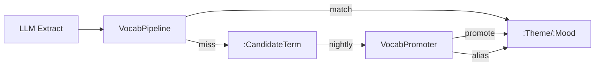

# Auto-evolving Vocabulary

```mermaid
flowchart LR
    Extract[LLM Extract] --> Norm[VocabPipeline]
    Norm -->|match| Standard[:Theme/:Mood]
    Norm -->|miss| Candidate[:CandidateTerm]
    Candidate -->|nightly| Promoter[VocabPromoter]
    Promoter -->|promote| Standard
    Promoter -->|alias| Standard
```

Cron: `0 4 * * *` (04:00 KST) — `VocabPromoter.run_batch()`
