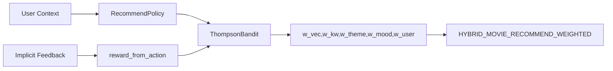

# Contextual Bandit Weights

```mermaid
flowchart LR
    User[User Context] --> Policy[RecommendPolicy]
    Policy --> Bandit[ThompsonBandit]
    Bandit --> Weights["w_vec,w_kw,w_theme,w_mood,w_user"]
    Weights --> Hybrid[HYBRID_MOVIE_RECOMMEND_WEIGHTED]
    Feedback[Implicit Feedback] --> Reward[reward_from_action]
    Reward --> Bandit
```

Baseline arm 최소 5% 노출 (`BANDIT_BASELINE_MIN_SHARE`).
