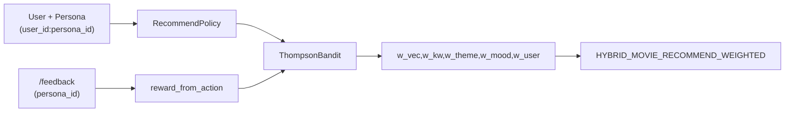

# Contextual Bandit Weights

> Bandit posterior 는 **Persona 스코프** 로 분리된다.
> `context_key = "{user_id}:{persona_id}"` (persona 없으면 `user_id` 만).

## context_key 규약

| 입력 | `context_key` | 설명 |
|------|---------------|------|
| `user_id=u-1`, `persona_id=movie_buff` | `u-1:movie_buff` | Persona 별 arm posterior |
| `user_id=u-1`, `persona_id=null` | `u-1` | User-level fallback |

동일 `user_id` 의 서로 다른 Persona 는 **독립적인** Bandit 상태(`bandit_state.context_key`)를 가진다.

## 도메인 연동

| 도메인 | Bandit 사용 |
|--------|-------------|
| Chat | `select_weights(context_key=user_id:persona_id)` |
| `/recommend` | `select_arm(context_key=…)` |
| `/feedback` | `record_reward(context_key=…)` — `content_type` 으로 feed/comment/movie 구분 |

Baseline arm 최소 5% 노출 (`BANDIT_BASELINE_MIN_SHARE`).

상세: [persona_recommendation.md](persona_recommendation.md)
