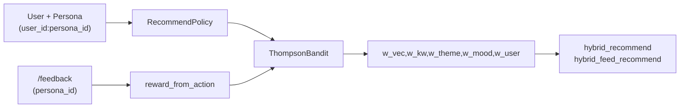

# Contextual Bandit Weights

> Bandit posterior 는 **Persona 스코프** 로 분리된다.
> `context_key = "{user_id}:{persona_id}"` (persona 없으면 `user_id` 만).

---

## context_key 규약

| 입력 | `context_key` | 설명 |
|------|---------------|------|
| `user_id=u-1`, `persona_id=movie_buff` | `u-1:movie_buff` | Persona 별 arm posterior |
| `user_id=u-1`, `persona_id=null` | `u-1` | User-level fallback |

동일 `user_id` 의 서로 다른 Persona 는 **독립적인** Bandit 상태(`bandit_state.context_key`)를 가진다.

---

## Bandit Arms

`src/recommend/arms.py` — `DEFAULT_ARMS` (6종):

| arm_id | w_vec | w_kw | w_theme | w_mood | w_user | 설명 |
|--------|-------|------|---------|--------|--------|------|
| `baseline` | 0.55 | 0.15 | 0.10 | 0.05 | 0.15 | 기본 hybrid |
| `vec_heavy` | 0.70 | 0.10 | 0.08 | 0.02 | 0.10 | semantic 중심 |
| `kw_heavy` | 0.40 | 0.30 | 0.12 | 0.08 | 0.10 | keyword 중심 |
| `user_heavy` | 0.45 | 0.10 | 0.10 | 0.05 | 0.30 | personalization 중심 |
| `balanced` | 0.50 | 0.15 | 0.15 | 0.10 | 0.10 | 균형 |
| `theme_mood` | 0.45 | 0.10 | 0.20 | 0.15 | 0.10 | theme/mood 중심 |

---

## 도메인 연동

| 도메인 | Bandit 사용 |
|--------|-------------|
| `/recommend/movie` | `select_arm(context_key=…)` → `hybrid_recommend` |
| `/recommend/feed` | `select_arm(context_key=…)` → `hybrid_feed_recommend` |
| `/feedback` | `record_reward(context_key=…)` — `content_type` 으로 feed/comment/movie 구분 |
| Chat (`/chat/stream`) | **미사용** — Bandit 학습은 Recommend + Feedback 경로 |

Baseline arm 최소 5% 노출 (`BANDIT_BASELINE_MIN_SHARE`, 기본 0.05).

---

## Reward 매핑

`src/recommend/reward_aggregator.py` — `reward_from_action()`:

| action | reward (개념) |
|--------|---------------|
| `click` | 양수 (약함) |
| `dwell` | 체류 시간 비례 |
| `like` | 강한 양수 |
| `skip` | 약한 음수 |
| `dislike` | 강한 음수 |

---

## 저장소

- PostgreSQL `bandit_state` — Thompson α/β posterior write-through
- DDL: `src/recommend/bandit_schema.sql`
- Store: `src/recommend/bandit_store.py`

상세: [persona_recommendation.md](persona_recommendation.md)
