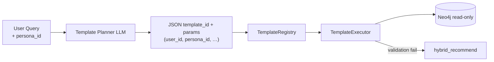

# Cypher Template Registry

> Hybrid 추천 Cypher 는 `$persona_id` 파라미터를 받아 Persona-scoped `PREFERS` / `INTERACTED` 를 조회한다.
> 상세: [persona_recommendation.md](persona_recommendation.md)



## Persona 파라미터

| 파라미터 | 필수 | 설명 |
|----------|------|------|
| `$user_id` | Y | 계정 식별자 |
| `$persona_id` | N | 존재 시 Persona-scoped 선호·상호작용 사용 |

- LLM 은 raw Cypher 를 생성하지 않는다.
- 등록된 5개 템플릿만 실행 가능하다.
- 검증 실패 시 `hybrid_recommend` 로 자동 fallback 한다.

## `hybrid_recommend` Persona 분기

```
persona_id 존재 → MATCH (p:Persona {persona_id})-[pref:PREFERS]->(x)
persona_id 없음 → MATCH (u:User {user_id})-[p:PREFERS]->(x)  // fallback
```

Bandit 가중치(`$w_vec`, `$w_kw`, …)는 `context_key = user_id:persona_id` 로 선택된 arm 에서 주입된다.
