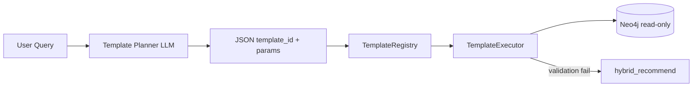

# Cypher Template Registry

```mermaid
flowchart LR
    UserQuery[User Query] --> LLM[Template Planner LLM]
    LLM --> Intent["JSON template_id + params"]
    Intent --> Registry[TemplateRegistry]
    Registry --> Executor[TemplateExecutor]
    Executor --> Neo4j[(Neo4j read-only)]
    Executor -->|validation fail| Fallback[hybrid_recommend]
```

- LLM 은 raw Cypher 를 생성하지 않는다.
- 등록된 5개 템플릿만 실행 가능하다.
- 검증 실패 시 `hybrid_recommend` 로 자동 fallback 한다.
