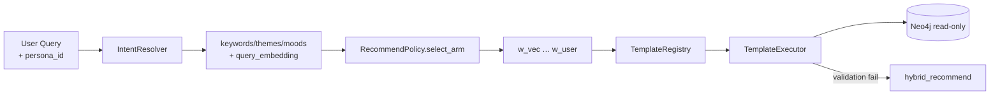

# Cypher Template Registry

> Hybrid 추천 Cypher 는 `$persona_id` 파라미터를 받아 Persona-scoped `PREFERS` / `INTERACTED` 를 조회한다.
> 상세: [persona_recommendation.md](persona_recommendation.md)

본 Registry 는 **`/recommend/movie`**, **`/recommend/feed`** API 전용이다.
Chat (`/chat/stream`) 은 별도로 `GraphCypherQAChain` (`src/chat/cypher/service.py`) 을 사용한다.



---

## 등록 템플릿

`src/graph/templates/__init__.py` — `build_default_registry()`:

| template_id | Cypher | 설명 |
|-------------|--------|------|
| `hybrid_recommend` | `HYBRID_MOVIE_RECOMMEND_WEIGHTED` | 영화 hybrid 추천 |
| `hybrid_feed_recommend` | `HYBRID_FEED_RECOMMEND_WEIGHTED` | 피드 hybrid 추천 |

> 이전 문서의 "5개 템플릿" 은 구현 초기 설계였으며, 현재 코드에는 위 2종만 등록되어 있다.

---

## Persona 파라미터

| 파라미터 | 필수 | 설명 |
|----------|------|------|
| `$user_id` | Y | 계정 식별자 |
| `$persona_id` | N | 존재 시 Persona-scoped 선호·상호작용 사용 |
| `$query_embedding` | Y | BGE/Qwen3 embedding (1024-dim) |
| `$query_keywords` | Y | IntentResolver 추출 키워드 |
| `$query_themes` | Y | IntentResolver 추출 테마 |
| `$query_moods` | Y | IntentResolver 추출 무드 |
| `$top_k` | Y | 반환 후보 수 |
| `$vec_top_k` | Y | 벡터 후보 pool 크기 |
| `$w_vec` … `$w_user` | Y | Bandit arm 가중치 |
| `$max_toxicity` | Y | toxicity 필터 상한 |

---

## 보안·운영 규칙

- `TemplateRegistry` 는 **read-only** Cypher 만 허용 (`CREATE`, `MERGE`, `DELETE` 등 write 키워드 차단).
- `TemplateExecutor.execute()` 는 파라미터 스키마 검증 후 실행.
- 검증 실패 시 `hybrid_recommend` 로 자동 fallback (`fallback=True` 기본).

---

## `hybrid_recommend` Persona 분기

```
persona_id 존재 → MATCH (p:Persona {persona_id})-[pref:PREFERS]->(x)
persona_id 없음 → MATCH (u:User {user_id})-[p:PREFERS]->(x)  // fallback
```

Bandit 가중치(`$w_vec`, `$w_kw`, …)는 `context_key = user_id:persona_id` 로 선택된 arm 에서 주입된다.

---

## Chat Cypher (Registry 외)

Chat Agent 의 `query_neo4j_graph` tool:

| 모듈 | 역할 |
|------|------|
| `src/chat/cypher/service.py` | `Neo4jCypherService` — GraphCypherQAChain + CyVer |
| `src/chat/cypher/sanitize.py` | Cypher 정제·write 키워드 차단 |
| `src/chat/cypher/tools/neo4j_query.py` | LangChain StructuredTool |

- LLM 이 자연어 → read-only Cypher 생성
- `SyntaxValidator`, `SchemaValidator`, `PropertiesValidator` (CyVer) 로 검증
- 실패 시 agent 가 조건 수정 후 재호출 (max 15 루프)

---

## 관련 모듈

| 파일 | 역할 |
|------|------|
| `src/graph/template_registry.py` | `CypherTemplate`, `TemplateRegistry` |
| `src/graph/template_executor.py` | `TemplateExecutor.execute()` |
| `src/graph/cypher_statements/retrieval.py` | Hybrid Cypher 본문 |
| `src/recommend/context.py` | `build_hybrid_recommend_params()` |
