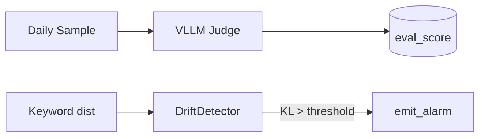

# LLM-as-Judge

```mermaid
flowchart LR
    Sample[Daily Sample] --> Judge[VLLM Judge]
    Judge --> PG[(eval_score)]
    Keywords[Keyword dist] --> Drift[DriftDetector]
    Drift -->|KL > threshold| Alarm[emit_alarm]
```

Cron: daily judge sample (`JUDGE_DAILY_SAMPLE_SIZE`).
