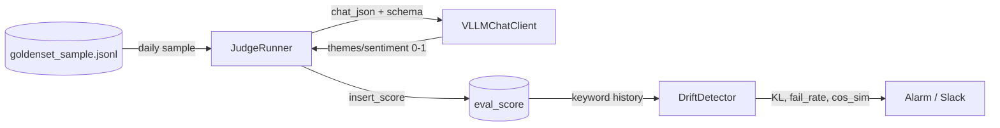

# LLM Judge & Drift Monitoring

Daily golden-set sampling, vLLM-based ontology quality scoring, PostgreSQL persistence, and drift alarms.

## Flow



## Components

| Module | Role |
|--------|------|
| `src/eval/judge_prompts.py` | System prompt + JSON schema (schema/themes/sentiment 0–1) |
| `src/eval/judge_runner.py` | Sample → judge → `eval_score` |
| `src/eval/drift_detector.py` | KL on keywords, failure rate, mean cos_sim |
| `src/eval/alarm.py` | Threshold logging + optional Slack webhook |
| `src/persistence/eval_schema.sql` | `eval_score` table DDL |
| `scripts/build_goldenset.py` | 30-row dummy goldenset |

## Configuration

| Variable | Default | Description |
|----------|---------|-------------|
| `JUDGE_DAILY_SAMPLE_SIZE` | 100 | Max rows judged per run |
| `DRIFT_KL_THRESHOLD` | 0.15 | KL(P\|\|Q) alert threshold |
| `EVAL_SLACK_WEBHOOK_URL` | (empty) | Optional Slack incoming webhook |

## Usage

```bash
python -m scripts.build_goldenset
python -c "from src.eval.judge_runner import JudgeRunner; JudgeRunner().run_daily()"
```

Bootstrap Postgres schema (includes `eval_score` when using `EvalScoreStore.init_schema()`).
