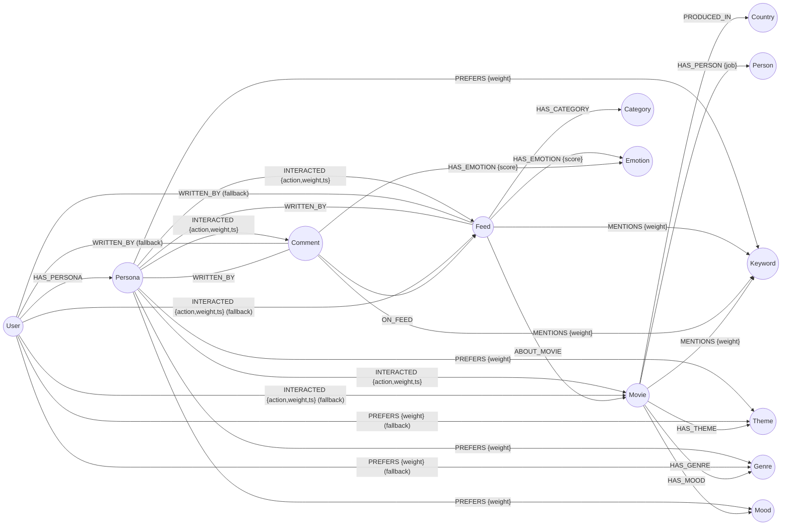
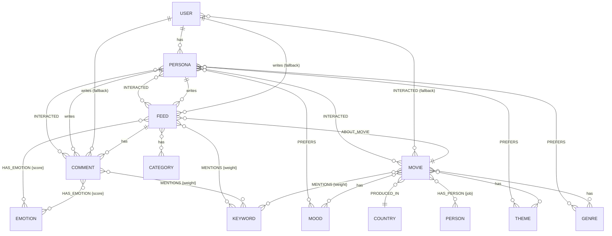

# Neo4j 기본 자료 구성

> 본 문서는 **knowledge graph** 의 노드/관계/인덱스 구성을 정의한다.
> 실제 DDL 은 `src/graph/cypher_statements/` 패키지(`schema.py`, `retrieval.py` 등)에 코드화되어 있으며,
> `python -m scripts.bootstrap_schema` 로 멱등 적용된다.

---

## 1. 노드 / 관계 다이어그램



> **Persona 스코프**: `persona_id` 가 존재하면 `PREFERS` / `INTERACTED` / `WRITTEN_BY` 는 `(:Persona)` 에 연결한다.
> `persona_id` 가 없으면 기존 `(:User)` 직접 연결(fallback)을 사용한다.
> 상세: [persona_recommendation.md](persona_recommendation.md)


---

## 2. 노드 속성 (Property Schema)

```mermaid
classDiagram
    class Movie {
        +String movie_id  PK
        +String title
        +Int    producing_year
        +String country
        +String plot_raw
        +String plot_summary
        +float[] plot_embedding_vN
        +DateTime updated_at
    }

    class Feed {
        +String feed_id  PK
        +String persona_id FK (optional)
        +String content_raw
        +String summary
        +float[] summary_embedding_vN
        +String sentiment
        +Float  sentiment_score
        +Bool   contains_spoiler
        +Float  toxicity_score
        +DateTime created_at
    }

    class Comment {
        +String comment_id PK
        +String persona_id FK (optional)
        +String content_raw
        +String summary
        +float[] summary_embedding_vN
        +String sentiment
        +Float  sentiment_score
        +Bool   contains_spoiler
        +Float  toxicity_score
        +DateTime created_at
    }

    class User {
        +String user_id PK
        +String nickname
        +DateTime created_at
    }

    class Persona {
        +String persona_id PK
        +String user_id FK
        +String label
        +DateTime created_at
    }

    class Keyword {
        +String normalized PK
        +String term
        +String kind   "entity|concept|theme|mood|trope|object|location|other"
    }

    class Genre { +String name PK }
    class Theme { +String name PK }
    class Mood  { +String name PK }
    class Category { +String name PK }
    class Emotion  { +String tag  PK }
    class Person   { +String person_id PK; +String name }
    class Country  { +String code PK; +String name }
```




---

## 3. 인덱스 / 제약 (Index Map)


| 카테고리        | 대상                                             | 종류            | 비고               |
| ----------- | ---------------------------------------------- | ------------- | ---------------- |
| Constraint  | `:Movie(movie_id)`                             | UNIQUE        | 멱등 upsert anchor |
| Constraint  | `:User(user_id)`                               | UNIQUE        |                  |
| Constraint  | `:Persona(persona_id)`                         | UNIQUE        | 추천 최소 단위 anchor |
| Constraint  | `:Feed(feed_id)`                               | UNIQUE        |                  |
| Constraint  | `:Comment(comment_id)`                         | UNIQUE        |                  |
| Constraint  | `:Keyword(normalized)`                         | UNIQUE        | 정규화 표제어 anchor   |
| Constraint  | `:Genre/Theme/Mood/Category(name)`             | UNIQUE        |                  |
| Constraint  | `:Emotion(tag)`                                | UNIQUE        |                  |
| Range Index | `:Movie(producing_year)`                       | RANGE         | 시간 필터            |
| Range Index | `:Persona(user_id)`                            | RANGE         | User→Persona lookup |
| Range Index | `:Feed(created_at)` / `:Feed(sentiment_score)` | RANGE         | 정렬/필터            |
| Fulltext    | `:Movie(title, plot_summary)`                  | CJK analyzer  | 한국어 키워드 검색       |
| Fulltext    | `:Feed(summary)` / `:Comment(summary)`         | CJK analyzer  |                  |
| Fulltext    | `:Keyword(term, normalized)`                   | CJK analyzer  |                  |
| Vector      | `:Movie(plot_embedding_vN)`                    | cosine, dim=N | semantic 추천 (버전별) |
| Vector      | `:Feed(summary_embedding_vN)`                  | cosine, dim=N | 피드 의미검색 (버전별)   |
| Vector      | `:Comment(summary_embedding_vN)`               | cosine, dim=N | 댓글 의미검색 (버전별)   |


> N = `EMBED__DIMENSION`(기본 1024, Qwen3-Embedding-0.6B 기준).
> 버전드 임베딩 상세: [versioned_embedding.md](versioned_embedding.md)

---

## 4. 데이터 흐름 ER 관점




---

## 5. 핵심 쿼리 예시

### 5-1. Semantic + Keyword Hybrid 추천

```cypher
// 1) Vector similarity 계산 (index 자동 활용)
MATCH (m:Movie)
WHERE m.plot_embedding IS NOT NULL
WITH m, vector.similarity.cosine(m.plot_embedding, $query_embedding) AS vec_score
ORDER BY vec_score DESC
LIMIT $vec_top_k

// 2) Keyword/Theme/Mood 부스트
OPTIONAL MATCH (m)-[:MENTIONS]->(k:Keyword)
WHERE k.normalized IN $query_keywords
WITH m, vec_score, count(DISTINCT k) AS kw_hits

OPTIONAL MATCH (m)-[:HAS_THEME]->(t:Theme)
WHERE t.name IN $query_themes
WITH m, vec_score, kw_hits, count(DISTINCT t) AS theme_hits

OPTIONAL MATCH (m)-[:HAS_MOOD]->(md:Mood)
WHERE md.name IN $query_moods
WITH m, vec_score, kw_hits, theme_hits, count(DISTINCT md) AS mood_hits

// 3) Persona preference 가중치 (persona_id 존재 시)
OPTIONAL MATCH (p:Persona {persona_id: $persona_id})-[pref:PREFERS]->(x)
WHERE x:Genre OR x:Theme OR x:Keyword
OPTIONAL MATCH (m)-[:HAS_GENRE|HAS_THEME|MENTIONS]->(x)
WITH m, vec_score, kw_hits, theme_hits, mood_hits,
     coalesce(sum(pref.weight), 0.0) AS persona_pref_score

// 3-fallback) persona_id 없을 때 User preference
OPTIONAL MATCH (u:User {user_id: $user_id})-[p:PREFERS]->(x2)
WHERE $persona_id IS NULL AND (x2:Genre OR x2:Theme OR x2:Keyword)
OPTIONAL MATCH (m)-[:HAS_GENRE|HAS_THEME|MENTIONS]->(x2)
WITH m, vec_score, kw_hits, theme_hits, mood_hits,
     coalesce(persona_pref_score, 0.0) + coalesce(sum(p.weight), 0.0) AS user_pref_score

// 4) 최종 스코어 산출 (가중 합)
WITH m,
     (0.55 * vec_score)
   + (0.15 * (1.0 - exp(-toFloat(kw_hits))))
   + (0.10 * (1.0 - exp(-toFloat(theme_hits))))
   + (0.05 * (1.0 - exp(-toFloat(mood_hits))))
   + (0.15 * tanh(user_pref_score)) AS score
ORDER BY score DESC
LIMIT $top_k

RETURN m.movie_id      AS movie_id,
       m.title         AS title,
       m.plot_summary  AS plot_summary,
       score
```

### 5-2. "이 영화에 대한 우호적인 피드" 추출

```cypher
MATCH (f:Feed)-[:ABOUT_MOVIE]->(m:Movie {movie_id: $movie_id})
WHERE f.sentiment_score >= 0.4 AND f.contains_spoiler = false
RETURN f
ORDER BY f.sentiment_score DESC, f.created_at DESC
LIMIT 20;
```

### 5-3. Persona 선호 그래프 업데이트(상호작용 기반)

```cypher
MATCH (u:User {user_id: $user_id})-[:HAS_PERSONA]->(p:Persona {persona_id: $persona_id})
MATCH (p)-[i:INTERACTED]->(m:Movie)
WHERE i.action IN ['like','watched_to_end']
MATCH (m)-[:HAS_THEME|HAS_GENRE|MENTIONS]->(x)
WITH p, x, sum(i.weight) AS w
MERGE (p)-[r:PREFERS]->(x)
SET r.weight = coalesce(r.weight, 0) * 0.9 + w * 0.1,
    r.updated_at = datetime();
```

> `persona_id` 가 없을 때는 `(:User)-[:INTERACTED]` → `(:User)-[:PREFERS]` 경로를 사용한다.

