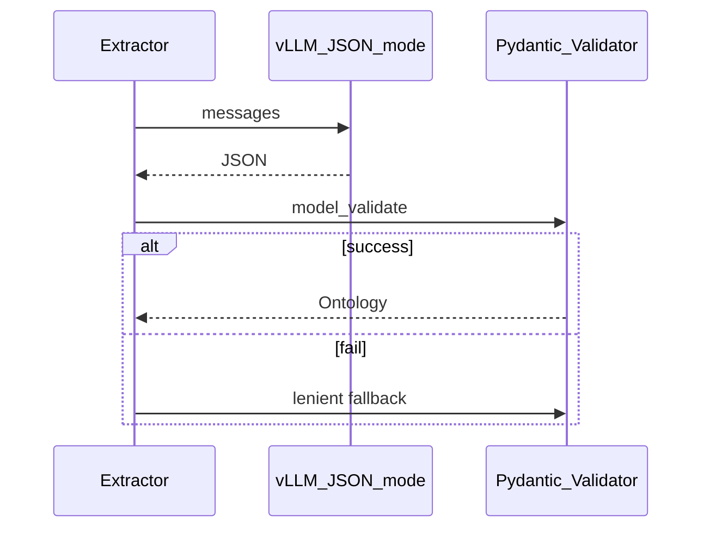

# 온톨로지 매핑 정책

> LLM/SLM 으로 비정형 텍스트 3종(영화 줄거리 / 피드 / 댓글)을
> 지식그래프 온톨로지로 변환하기 위한 **매핑 정책**.

---

## 1. 정제 대상과 목표

| 대상 | 입력 | 정제 목표 | 출력 스키마 |
|------|------|-----------|--------------|
| 영화 줄거리 | `movie.plot` (단문) | 요약 + themes/moods + 영화 지표 keywords | `MoviePlotOntology` |
| 피드 본문   | `feed.content` (비정형) | 글 특성 + 감정 + keywords + 참조 영화 | `FeedOntology` |
| 댓글 본문   | `comment.content` (비정형, 짧음) | 대상·반응 + 감정 + keywords | `CommentOntology` |

> 세 결과는 `OntologyResult` 를 상속해 공통 메타(`source_id`, `language`, `schema_version`)를 가진다.
> **schema_version** 은 `1.1`.

---

## 2. keywords.kind (영화 지표)

| kind | 설명 | 예시 |
|------|------|------|
| `era` | 시대적 배경 | 1980년대, 조선시대 |
| `environment` | 환경/공간 | 우주, 교도소, 어촌 마을 |
| `key_object` | 핵심 소재 | 타임머신, 복권, 일기장 |
| `source_form` | 원작 형태 | 웹툰 원작, 소설 원작 |
| `culture_code` | 문화 코드 | 홍콩 느와르, 한국 군대 문화 |
| `entity` | 인물/단체/작품명 | 검색 anchor |
| `other` | 위에 해당하지 않는 지표 | — |

- `themes`/`moods` 등 **전용 필드 값은 keywords 에 중복 금지**.
- `term`: 원문 표면형, `normalized`: 영어 snake_case 표제어.

---

## 3. 타입별 온톨로지 구조

### Movie (`MoviePlotOntology`)

- `summary`, `themes`, `moods` (폐쇄형 vocabulary), `keywords`, `toxicity_score`
- themes/moods vocabulary 가이드는 movie 프롬프트에만 주입

### Feed (`FeedOntology`)

- `category`: `informational` | `review` | `analysis` | `junk` (단일 선택)
- `sentiment`, `sentiment_score`, `emotions`, `keywords`
- `referenced_movie_ids`, `referenced_person_names`, `contains_spoiler`, `toxicity_score`

### Comment (`CommentOntology`)

- `target`: `feed` | `parent_comment`
- `reaction`: `positive` | `negative` | `empathy` | `supplement`
- `sentiment`, `sentiment_score`, `emotions`, `keywords`
- `targets_user_id`, `contains_spoiler`, `toxicity_score`

---

## 4. 프롬프트 모듈

`src/ontology/prompts/`

- **공통** `ONTOLOGY_SYSTEM_PROMPT`: 출력 원칙 + keywords 7종 정의
- **movie**: vocab guide 포함 (themes/moods 폐쇄형 목록)
- **feed / comment**: 타입 전용 가이드만 (vocab guide 없음)

> system role 상수는 모든 호출에서 동일하게 유지해 vLLM prefix-cache hit rate 를 극대화한다.

---

## 5. 검증 흐름

---

## 6. 운영 시 유의사항

- **schema_version** 변경 시 bump 후 마이그레이션 스크립트 실행.
- **toxicity_score** 임계값(예: 0.7) 초과 시 추천 가중치 0 또는 별도 큐.
- **contains_spoiler** 인 피드는 기본 추천에서 dim/exclude.
