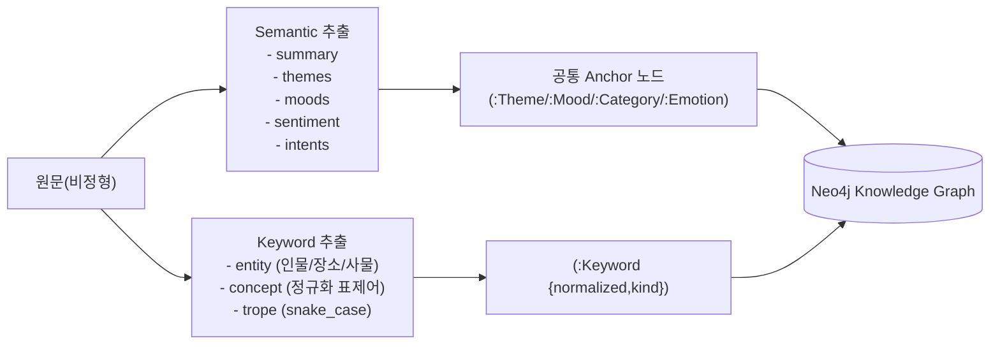
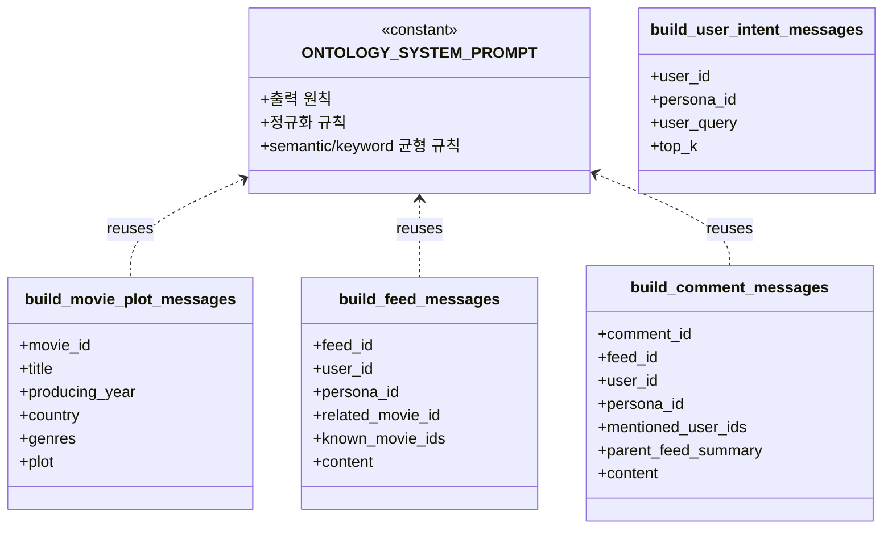
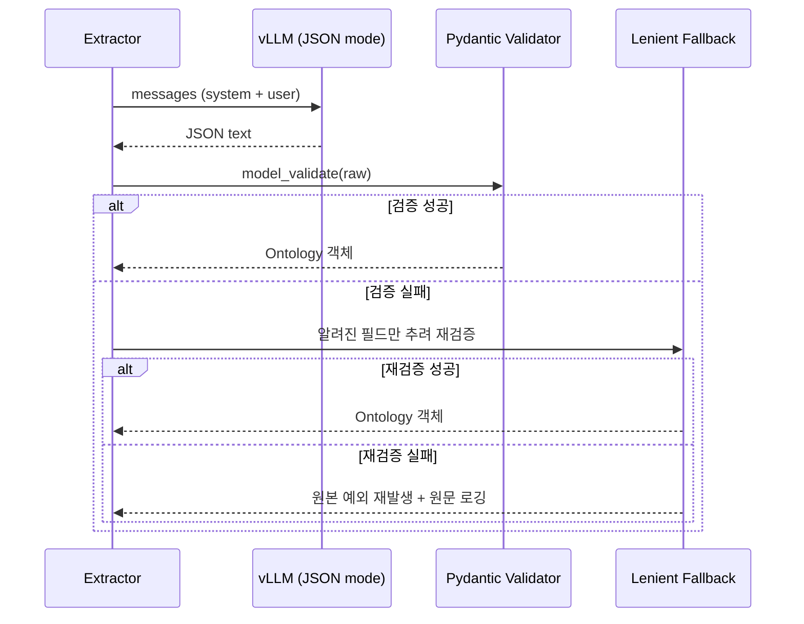

# 온톨로지 매핑 정책

> LLM/SLM 으로 비정형 텍스트 3종(영화 줄거리 / 피드 / 댓글)을
> 동일한 표상 체계로 끌어올리기 위한 **온톨로지 매핑 정책**.

---

## 1. 정제 대상과 목표

| 대상 | 입력 | 정제 목표 | 출력 스키마 |
|------|------|-----------|--------------|
| 영화 줄거리 | `movie.plot` (단문) | 의미 보존 요약 + 테마/무드/키워드 | `MoviePlotOntology` |
| 피드 본문   | `feed.content` (비정형) | 카테고리 + 감정 + 키워드 + 참조 영화 | `FeedOntology` |
| 댓글 본문   | `comment.content` (비정형, 짧음) | 의도 + 감정 + 키워드 | `CommentOntology` |

> Ingest 시 `persona_id` 는 온톨로지 스키마가 아닌 **적재 메타** 로 전달되며,
> Neo4j 에서 `(:Persona)` 와 `WRITTEN_BY` 관계를 형성한다.
> 추천은 `(user_id, persona_id)` 기준으로 Persona 선호를 사용한다.
> 상세: [persona_recommendation.md](persona_recommendation.md)

> 세 결과는 모두 `OntologyResult` 를 상속해 동일한 메타(`source_id`, `language`, `schema_version`)를 가진다.

---

## 2. semantic ⇄ keyword 균형 전략

- **Semantic anchor** 는 폐쇄형(Enum) 으로 강제해 휘발성/엔트로피를 낮춘다.
  - Sentiment 5단계, EmotionTag, FeedCategory, CommentIntent
- **Keyword anchor** 는 개방형(자유 어휘) 이되 `normalized` 로 동의어를 통합한다.
  - `kind` 로 종류를 분류해 검색/추천에서 가중치 차등 적용.

---

## 3. 프롬프트 모듈 구성

`src/ontology/prompts.py`

> 핵심: **system role 은 모든 호출에서 동일한 상수**.
> 이는 vLLM PagedAttention prefix cache hit rate 를 끌어올리는 핵심 설계 결정이다.

---

## 4. 검증 흐름

---

## 5. 운영 시 유의사항

- **schema_version** 은 1.0 으로 고정. 스키마 변경 시 bump 후 마이그레이션 스크립트 실행.
- **LLM 호출 격리**: extractor 는 단일 LLM 호출만 한다 (cost / latency 예측성 확보).
- **PII / Toxicity**: `toxicity_score` 가 임계값(예: 0.7)을 넘는 피드/댓글은
  추천 그래프에서 가중치 0으로 처리하거나 별도 큐로 보낸다.
- **Spoiler**: `contains_spoiler == true` 인 피드는 기본 추천에서 dim/exclude.
