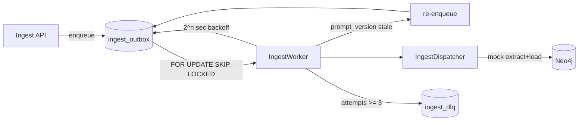

# Outbox Ingest

PostgreSQL transactional outbox로 movie / feed / comment 적재를 비동기 처리한다.

## 흐름



## 재처리

`payload.prompt_version` 또는 row `prompt_version` 이 `get_settings().ontology.prompt_version` 과 다르면 현재 설정으로 새 outbox row를 적재하고 기존 row는 `done` 처리한다.

## 스키마

`src/persistence/outbox_schema.sql` — `ingest_outbox`, `ingest_dlq` 및 `idx_ingest_outbox_pending` (pending/processing + `next_attempt_at`).

## 실행

```bash
python -m scripts.bootstrap_schema   # outbox DDL 포함
python -m scripts.run_ingest_worker    # 폴링 루프
python -m scripts.run_ingest_worker --once
```

환경: `PG_*`, `ONTOLOGY_PROMPT_VERSION`, `ONTOLOGY_MODEL_NAME` (`.env.example` 참고).
