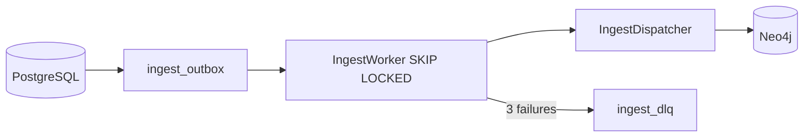

# Outbox Ingest

```mermaid
flowchart LR
    PG[(PostgreSQL)] --> Outbox[ingest_outbox]
    Outbox --> Worker[IngestWorker SKIP LOCKED]
    Worker --> Dispatcher[IngestDispatcher]
    Dispatcher --> Neo4j[(Neo4j)]
    Worker -->|3 failures| DLQ[ingest_dlq]
```

`prompt_version` 변경 시 hash 불일치 row 자동 재처리.
