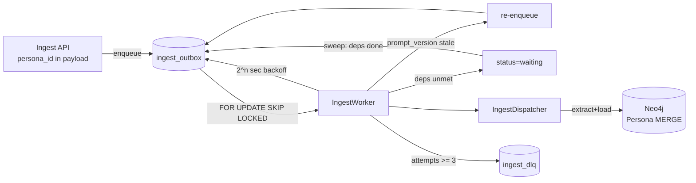

# Outbox Ingest

PostgreSQL transactional outbox로 movie / feed / comment 적재를 비동기 처리한다.

> Feed·Comment payload 에 `persona_id` 가 포함되면 Neo4j 적재 시 `(:Persona)` 노드와 `WRITTEN_BY` 관계가 생성된다.
> 상세: [persona_recommendation.md](persona_recommendation.md)

## 흐름



## 상태 머신

| 상태 | 의미 | 전이 |
|------|------|------|
| `pending` | 처리 대기 (기본값) | Worker claim 시 → `processing` |
| `processing` | 처리 중 | 성공 → `done`; 실패(attempts<3) → `pending` + backoff; deps 미충족 → `waiting`; attempts≥3 → `dlq` |
| `waiting` | 선행 작업 완료 대기 | sweep 에서 모든 dep done → `pending` |
| `done` | 완료 | — |
| `dlq` | Dead Letter (3회 실패) | `ingest_dlq` 에 복사 |

## 선행 의존성 (DependencyResolver)

`src/ingest/dependency.py` 에 정의된 규칙:

| aggregate_type | 선행 작업 | 비고 |
|----------------|----------|------|
| `comment` | `feed`(feed_id), `comment`(parent_comment_id) | parent_comment_id 선택 |
| `comment_modify` / `comment_delete` / `comment_like` | `comment`(comment_id) | |
| `feed_modify` / `feed_delete` / `feed_like` | `feed`(feed_id) | |
| `movie_judge` | `movie`(movie_id) | |
| `movie` / `feed` / `person_judge` | 없음 | |

### Sweep 메커니즘

Worker 매 폴링(run_once) 시작부에서 `release_ready()` 실행:

```sql
UPDATE ingest_outbox o SET status='pending', updated_at=NOW()
WHERE o.status='waiting'
  AND NOT EXISTS (
    SELECT 1 FROM ingest_dependencies d
    WHERE d.outbox_id = o.id
      AND NOT EXISTS (
        SELECT 1 FROM ingest_outbox p
        WHERE p.aggregate_type = d.dep_type
          AND p.aggregate_id = d.dep_id
          AND p.status = 'done'))
```

`ingest_outbox.status='done'` EXISTS 로 매번 재계산하므로 lost-wakeup 없음.

## 처리 핸들러 (aggregate_type)

| aggregate_type | 핸들러 | Neo4j 효과 |
|----------------|--------|------------|
| `movie` | extract + embed + upsert | Movie 노드 + 온톨로지 관계 |
| `feed` | extract + embed + upsert | Feed 노드 + 온톨로지 관계 |
| `comment` | context read + extract + embed + upsert | Comment 노드 + 온톨로지 관계 |
| `feed_modify` | feed 핸들러 재사용 (MERGE 멱등) | Feed 노드 갱신 |
| `comment_modify` | comment 핸들러 재사용 (MERGE 멱등) | Comment 노드 갱신 |
| `feed_like` | loader.like_feed | `INTERACTED` 관계 생성/삭제 |
| `comment_like` | loader.like_comment | `INTERACTED` 관계 생성/삭제 |
| `movie_judge` | loader.judge_movie | `INTERACTED` 관계 (like/dislike) |
| `person_judge` | loader.judge_person | `INTERACTED` 관계 (like/dislike) |
| `feed_delete` | loader.delete_feed | soft-delete (deleted=true) |
| `comment_delete` | loader.delete_comment | soft-delete (deleted=true) |

## Persona 필드 (feed / comment)

| Payload | `persona_id` | Neo4j 효과 |
|---------|--------------|------------|
| `IngestFeedPayload` | 선택 | `MERGE (:Persona)` + `(:Feed)-[:WRITTEN_BY]->(:Persona)` |
| `IngestFeedLikePayload` | 선택 | `(:Persona)-[:INTERACTED]->(:Feed)` |
| `IngestCommentPayload` | 선택 | `MERGE (:Persona)` + `(:Comment)-[:WRITTEN_BY]->(:Persona)` |
| `IngestCommentLikePayload` | 선택 | `(:Persona)-[:INTERACTED]->(:Comment)` |

`persona_id` 가 없으면 기존 `(:User)` 직접 연결(fallback)을 사용한다.

## 재처리

`payload.prompt_version` 또는 row `prompt_version` 이 `get_settings().ontology.prompt_version` 과 다르면 현재 설정으로 새 outbox row를 적재하고 기존 row는 `done` 처리한다.

## 스키마

`src/persistence/outbox_schema.sql` — `ingest_outbox`, `ingest_dependencies`, `ingest_dlq` 및 관련 인덱스.

## 실행

```bash
python -m scripts.bootstrap_schema   # outbox DDL 포함
python -m scripts.run_ingest_worker    # 폴링 루프
python -m scripts.run_ingest_worker --once
```

환경: `PG_*`, `ONTOLOGY_PROMPT_VERSION`, `ONTOLOGY_MODEL_NAME` (`.env.example` 참고).
