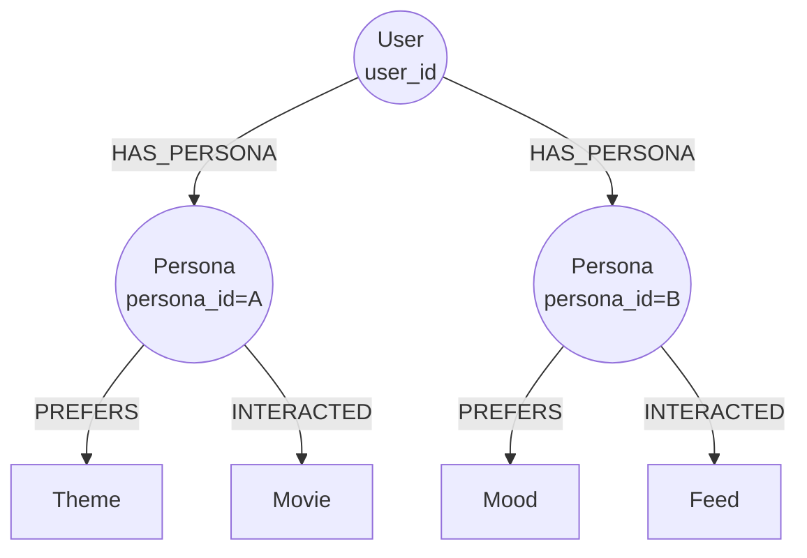
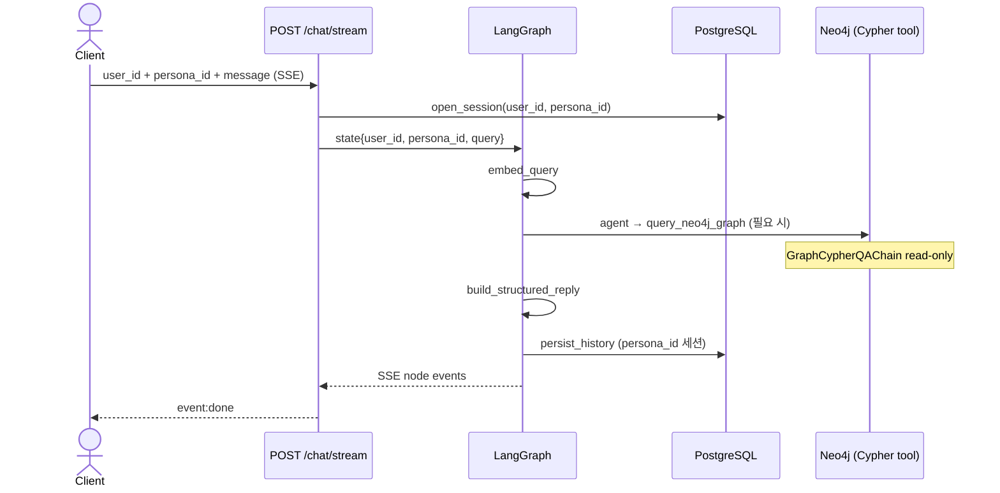

# Persona 기반 추천

> **Persona** 는 추천 알고리즘을 구성하는 **최소 단위**이다.
> 모든 추천·피드백·세션 상태는 `(user_id, persona_id)` 복합 키로 스코프된다.

---

## 1. 개념

| 용어 | 설명 |
|------|------|
| `User` | 계정 단위 식별자 (`user_id`) |
| `Persona` | 한 사용자 안에서 **취향·맥락·역할** 을 분리하는 하위 프로필 (`persona_id`) |
| `(user_id, persona_id)` | 추천·Bandit·세션·상호작용의 **기본 컨텍스트 키** |

한 `User` 는 여러 `Persona` 를 가질 수 있다. 예: `movie_buff`(영화 덕후), `family_night`(가족용), `horror_fan`(공포 전용).



Persona 등록/수정/삭제: `POST /ingest/persona/create|modify|delete`

---

## 2. Persona 존재 여부에 따른 동작

| `persona_id` | 추천 동작 |
|--------------|-----------|
| **존재** | Persona 스코프 선호·상호작용·Bandit posterior·세션 이력을 사용 |
| **없음 (`null`)** | `user_id` 단독 컨텍스트로 fallback (User-level 선호) |

> **규칙**: `persona_id` 가 요청에 포함되면, 해당 Persona 의 그래프·DB 상태만 읽고 갱신한다.
> 다른 Persona 의 `PREFERS` / `INTERACTED` / Bandit arm 은 섞이지 않는다.

---

## 3. 도메인별 파생 추천 로직

### 3-1. Chat (`/chat/stream`, LangGraph)



- `ChatState.persona_id` — LangGraph 노드 간 공유 ([`src/chat/state.py`](../src/chat/state.py))
- Chat 은 Bandit arm 을 직접 선택하지 않는다. Neo4j 조회는 Agent + `query_neo4j_graph` tool
- `chat_session` / `chat_message` — Postgres 에 `persona_id` 컬럼으로 세션·이력 격리

### 3-2. Feed 추천

피드 ingest 시 `persona_id` 를 함께 적재하면, 해당 Persona 의 작성·상호작용 이력이 그래프에 연결된다.

| 단계 | Persona 반영 |
|------|--------------|
| Ingest (`/ingest/feed/*`) | `MERGE (:Persona)` + `(:Feed)-[:WRITTEN_BY]->(:Persona)` |
| Like / 상호작용 | `(:Persona)-[:INTERACTED {action}]->(:Feed\|:Movie)` |
| `/recommend/feed` | `hybrid_feed_recommend` Cypher + `$persona_id` 선호 가중치 |
| Ontology | `FeedOntology` 추출 결과는 Feed 노드에 저장; **선호 학습** 만 Persona 스코프 |

피드 추천 스코어(개념):

```
feed_score = w_vec · cosine(feed.summary_embedding, query_embedding)
           + w_kw  · keyword_overlap
           + w_user · tanh(persona_pref_score)    // Persona-scoped PREFERS
           + w_inter · persona_interaction_boost    // Persona-scoped INTERACTED
```

### 3-3. Comment 추천

댓글은 짧은 텍스트이므로 **의도 + 감정 + Persona 선호** 를 결합한다. Chat Agent 가 Cypher tool 로 댓글/피드를 조회할 수 있다.

| 단계 | Persona 반영 |
|------|--------------|
| Ingest (`/ingest/comment/*`) | `(:Comment)-[:WRITTEN_BY]->(:Persona)` |
| 랭킹 | 부모 Feed 의 Persona 작성자 affinity, 요청 Persona 의 Theme/Mood 선호 매칭 |
| 필터 | `toxicity_score`, `contains_spoiler` — Persona 무관 공통 규칙 |

### 3-4. Movie / Feed 추천 API

| 엔드포인트 | Cypher 템플릿 |
|-----------|--------------|
| `POST /recommend/movie` | `hybrid_recommend` |
| `POST /recommend/feed` | `hybrid_feed_recommend` |

공통 처리:

```
context_key = f"{user_id}:{persona_id}" if persona_id else user_id
```

- `IntentResolver` — 질의에서 keyword/theme/mood 추출 (Persona 무관)
- `RecommendPolicy.select_arm(context_key)` — Persona 별 Bandit arm
- `TemplateExecutor` — Bandit `w_*` + `$persona_id` 로 hybrid Cypher 실행

---

## 4. API 전달 규약

| 채널 | `persona_id` 위치 |
|------|-------------------|
| `/chat/stream`, `/chat/list`, `/chat/history/{session_id}` | 요청 body **또는** `X-Persona-Id` 헤더 |
| `/recommend/movie`, `/recommend/feed` | 요청 body **또는** `X-Persona-Id` 헤더 |
| `/feedback` | 요청 body (`persona_id` 선택) |
| `/ingest/feed`, `/ingest/comment` (create/like) | payload body |
| `/ingest/person/judge` | payload body (`persona_id` 선택) |

헤더와 body 모두 존재할 때 **헤더 우선** (`resolve_persona_id`).

---

## 5. 저장소 스키마 요약

### Neo4j

- `(:Persona {persona_id, user_id, label?, created_at})`
- `(:User)-[:HAS_PERSONA]->(:Persona)`
- `(:Persona)-[:PREFERS {weight}]->(:Genre|:Theme|:Mood|:Keyword)`
- `(:Persona)-[:INTERACTED {action, weight, ts}]->(:Movie|:Feed|:Comment|:Person)`
- `(:Feed|:Comment)-[:WRITTEN_BY]->(:Persona)` (persona_id 제공 시)

상세: [neo4j_schema.md](neo4j_schema.md)

### PostgreSQL

| 테이블 | Persona 컬럼 |
|--------|--------------|
| `chat_session` | `persona_id TEXT NOT NULL` |
| `chat_message` | `persona_id TEXT NOT NULL` |
| `bandit_state` | `context_key = "{user_id}:{persona_id}"` |

---

## 6. Bandit / Feedback

`/feedback` 요청 시:

```json
{
  "user_id": "u-1",
  "persona_id": "movie_buff",
  "arm_id": "balanced",
  "action": "like",
  "content_type": "movie"
}
```

- `context_key = "u-1:movie_buff"` → Persona 별 Thompson posterior 갱신
- `persona_id` 없으면 `context_key = "u-1"`

상세: [bandit_weights.md](bandit_weights.md)

---

## 7. 구현 체크리스트

| 모듈 | Persona 연동 |
|------|--------------|
| `src/chat/state.py` | `persona_id` 상태 필드 |
| `src/chat/nodes/persistence.py` | `persist_history` — persona_id 세션 저장 |
| `src/recommend/policy.py` | `context_key = user_id:persona_id` |
| `src/recommend/context.py` | `resolve_persona_id`, `build_hybrid_recommend_params` |
| `src/graph/cypher_statements/retrieval.py` | Persona-scoped `PREFERS` / `INTERACTED` MATCH |
| `src/persistence/chat_history.py` | 세션·메시지 `persona_id` 필터 |
| `src/api/schemas/*` | feed/comment/chat/recommend/feedback/persona payload |
| `src/graph/loader.py` | feed/comment upsert 시 Persona MERGE |
| `src/ingest/dispatcher/persona.py` | persona create/modify/delete handler |
