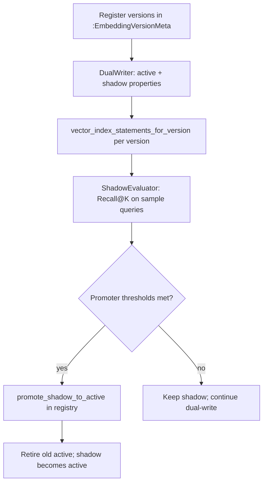

# Versioned plot embeddings

Neo4j `Movie` nodes store plot vectors in versioned properties (`plot_embedding_v1`, `plot_embedding_v2`, …). A single **active** version serves production retrieval; an optional **shadow** version receives dual-writes for offline evaluation before promotion.

## Flow



## Components

| Module | Responsibility |
|--------|----------------|
| `version_registry.py` | `:EmbeddingVersionMeta` CRUD, `get_active_version()`, `register_version()` |
| `dual_writer.py` | Write `plot_embedding` vector to `plot_embedding_v{version}` for active + shadow |
| `shadow_evaluator.py` | Compare Recall@K (injectable retriever) |
| `promoter.py` | Promote shadow when `recall_delta` and `min_shadow_recall` pass |
| `cypher_statements.vector_index_statements_for_version` | Per-version vector index DDL |

## Configuration

`EmbeddingSettings.dimension` defaults to **1024** (BGE-M3). Vector index DDL must use the same dimension.

## Dry run

```bash
python scripts/embed_migrate_dryrun.py --target-version 2
```

Reports counts and planned DDL without writing to Neo4j.
