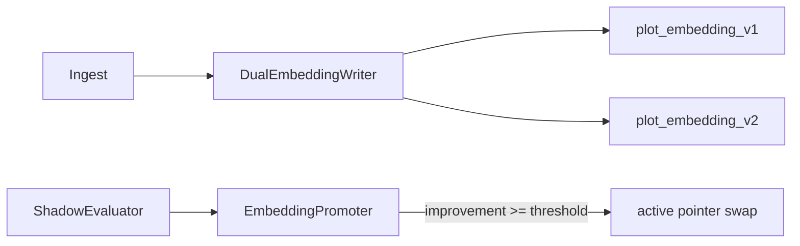

# Versioned Embedding

```mermaid
flowchart LR
    Ingest[Ingest] --> DualWrite[DualEmbeddingWriter]
    DualWrite --> ActiveProp[plot_embedding_v1]
    DualWrite --> ShadowProp[plot_embedding_v2]
    ShadowEval[ShadowEvaluator] --> Promoter[EmbeddingPromoter]
    Promoter -->|improvement >= threshold| Swap[active pointer swap]
```

- Active + shadow 속성에 동시 기록
- Recall@K 개선 시 shadow 를 active 로 승격
