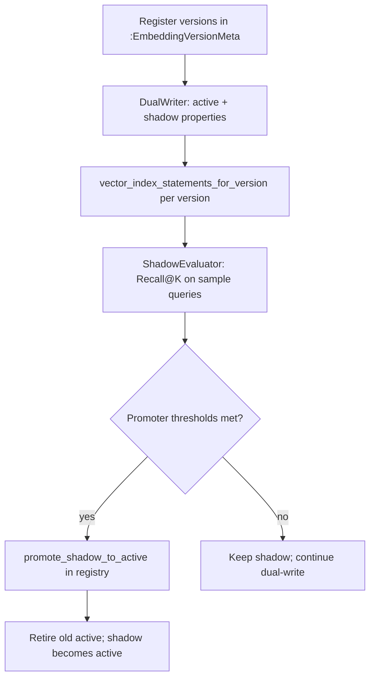

# Versioned plot embeddings

Neo4j `Movie` / `Feed` / `Comment` nodes store vectors in versioned properties (`plot_embedding_v1`, `summary_embedding_v2`, …). A single **active** version serves production retrieval; an optional **shadow** version receives dual-writes for offline evaluation before promotion.

---

## Flow



---

## Components

| Module | Responsibility |
|--------|----------------|
| `version_registry.py` | `:EmbeddingVersionMeta` CRUD, `get_active_version()`, `register_version()` |
| `dual_writer.py` | Movie `plot_embedding_v{version}` active + shadow dual-write |
| `summary_dual_writer.py` | Feed/Comment `summary_embedding_v{version}` dual-write |
| `shadow_evaluator.py` | Compare Recall@K (injectable retriever) |
| `promoter.py` | Promote shadow when `recall_delta` and `min_shadow_recall` pass |
| `reembed_planner.py` | 버전 변경 시 outbox re-embed job enqueue |
| `cypher_statements/schema.py` | `vector_index_statements_for_version()` — per-version vector index DDL |

---

## Configuration

| Variable | Default | Description |
|----------|---------|-------------|
| `EMBED__DIMENSION` | 1024 | Neo4j vector index dimension (Qwen3-Embedding-0.6B) |
| `EMBED__NORMALIZE` | true | L2 normalize before store |

Vector index DDL must use the same dimension as `EMBED__DIMENSION`.

---

## CLI

```bash
# 버전 등록, re-embed enqueue, promotion
python scripts/embed_migrate.py --help

# 스키마 + outbox DDL
python -m scripts.bootstrap_schema
```

Re-embed worker aggregate: `movie_reembed`, `feed_reembed`, `comment_reembed` ([outbox_ingest.md](outbox_ingest.md)).

---

## Property naming

| Entity | active property | 예시 |
|--------|-----------------|------|
| Movie | `plot_embedding_v{N}` | `plot_embedding_v1` |
| Feed | `summary_embedding_v{N}` | `summary_embedding_v1` |
| Comment | `summary_embedding_v{N}` | `summary_embedding_v1` |

Legacy `plot_embedding` / `summary_embedding` (버전 없음) 필드는 마이그레이션 중 fallback 으로 참조될 수 있다.
